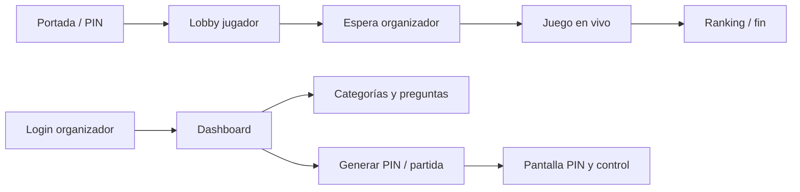

# ¿Y esa Pregunta?

Aplicación web para **sesiones de preguntas en vivo al estilo Kahoot**: un organizador crea partidas con PIN, los participantes se unen desde sus dispositivos y compiten por puntos en tiempo real. El producto está pensado para **formación, aulas, eventos y gamificación** sin depender de servicios de terceros.

---

## Qué problema resuelve

| Para el organizador | Para los participantes |
|---------------------|------------------------|
| Panel para administrar categorías, banco de preguntas y usuarios | Entrada simple desde la portada con un **PIN de 6 dígitos** |
| Generación de partidas con límite de preguntas y categoría (o todas) | **Lobby** con nombre y ficha de color |
| Pantalla de partida en vivo, control de inicio/fin y ranking | **Juego** con temporizador por pregunta y respuestas A–D |
| Historial de partidas | Experencia móvil con Bootstrap |

---

## Flujo general



1. **Participante**: abre la página principal, introduce el PIN; si la partida está en estado *Esperando*, accede al registro en el lobby.
2. **Organizador**: inicia sesión, configura contenido (categorías y cuestionario), genera una partida (PIN), comparte el código y desde la vista de partida **inicia el juego** cuando estén listos los jugadores.
3. Durante el juego, las preguntas y el tiempo por pregunta dependen de la configuración de la partida; las respuestas se registran vía API en PHP.

---

## Funcionalidades principales

### Administración (usuario autenticado)

- **Panel (dashboard)**: gestión de administradores (alta, edición, activar/desactivar).
- **Categorías**: organización del banco de preguntas.
- **Banco de preguntas (cuestionario)**: preguntas de opción múltiple (A–B–C–D) con respuesta correcta; activación/desactivación y edición.
- **Partidas**: generar PIN, enlazar preguntas aleatorias a la partida (por categoría o banco completo), historial.
- **Modo muerte súbita** (cuando está aplicada la migración SQL correspondiente): partidas con eliminaciones periódicas según puntuación hasta dejar un grupo reducido de finalistas.

### Sala de juego (participantes)

- Unión por PIN solo mientras la partida está en **Esperando** (no tras pulsar “Iniciar juego”).
- Lobby con lista de jugadores; el organizador puede iniciar o terminar la partida.
- Juego con sincronización de estado de partida y carga de preguntas vía endpoints JSON.

### Seguridad y calidad

- Sesiones PHP con cookies adecuadas (incl. consideración de **HTTPS detrás de proxy**).
- **Protección CSRF** en formularios y peticiones AJAX relevantes.
- Conexión a base de datos con **PDO** y sentencias preparadas en los controladores revisados.
- Configuración sensible fuera del repositorio: `config/config.php` (plantilla en `config/config.example.php`).

---

## Stack tecnológico

| Capa | Tecnología |
|------|------------|
| Backend | **PHP** (servidor Apache, típico en **XAMPP**) |
| Datos | **MySQL** / MariaDB |
| Frontend público y admin | HTML, **Bootstrap 5**, **JavaScript** (fetch, módulos en parte del admin) |
| UI interactiva | **SweetAlert2**, **jQuery** / **DataTables** en panel administrativo |
| Assets | **Sass**, **Pug** (plantillas fuente) — compilación con **Node.js** (`npm run build`) |
| PHP (Composer) | Dependencia declarada: **PhpSpreadsheet** (útil para importaciones/export tipo Excel si se amplía el proyecto) |

La carpeta **`dist/`** concentra CSS, JS y vistas PHP preparadas para servir; el código fuente de estilos/scripts puede vivir bajo `src/` según el flujo de build del proyecto.

---

## Requisitos

- PHP compatible con PDO MySQL (recomendado: la versión que incluye tu XAMPP o hosting).
- MySQL/MariaDB con base de datos dedicada (nombre por defecto en plantilla: `kahoot`).
- Extensiones PHP habituales: `pdo_mysql`, `json`, `mbstring` (recomendado para UTF-8 amplio).
- **Composer** (`composer install`) si se usan dependencias PHP del `composer.json`.
- **Node.js** solo si vas a **recompilar** estilos o scripts (`npm install`, `npm run build`).

---

## Instalación rápida

1. Clona o copia el proyecto en el directorio web del servidor (por ejemplo `htdocs/kahoot`).
2. Crea la base de datos e importa el esquema que uses en tu entorno (si entregáis un `.sql` maestro, úsalo aquí).
3. Copia la configuración:
   - `cp config/config.example.php config/config.php` (o equivalente en Windows).
   - Edita `config/config.php` con host, nombre de BD, usuario y contraseña.
4. Asegura permisos de escritura en **`logs/`** si activas fichero de log en configuración.
5. Ejecuta en la base de datos, si aplica, los scripts de la carpeta **`sql/`**:
   - `add_muerte_subita.sql` — columnas de modo muerte súbita.
   - `jugadores_utf8mb4.sql` — codificación para emojis/nombres con caracteres amplos.
   - `jugador_progreso_respuestas.sql` — seguimiento de progreso del jugador para panel en vivo.
6. (Opcional) `composer install` en la raíz del proyecto.
7. Abre en el navegador la URL del proyecto (ej. `http://localhost/kahoot/`).

La **entrada pública** es `index.php` en la raíz del proyecto.

---

## Estructura del proyecto (resumen)

```
kahoot/
├── config/                 # config.php (local, no versionado) + ejemplo
├── controller/             # Lógica HTTP: login, partidas, jugadores, categorías, cuestionarios, PIN…
├── dist/                   # CSS, JS, vistas PHP y assets servidos al cliente
├── includes/               # auth.php (sesión, CSRF), errores, helpers
├── models/                 # MySQL.php (PDO)
├── scripts/                # Build Node (pug, scss, assets)
├── sql/                    # Migraciones puntuales documentadas
├── src/                    # Fuentes front (según pipeline de build)
├── index.php               # Portada: unión por PIN
├── composer.json
└── package.json
```

Los **endpoints JSON** viven bajo `controller/` (por ejemplo `controller/partidas/`, `controller/jugadores/`); las páginas HTML PHP están principalmente en **`dist/views/`**.

---

## Desarrollo front

Para regenerar assets desde fuentes:

```bash
npm install
npm run build
```

Existen variantes `start` / `start:debug` con watch/build según `package.json`. El archivo `fiveserver.config.js` apunta a PHP de XAMPP para entornos que lo usen.

---

## Notas para despliegue con clientes

- Entregar **`config.example.php`** y documentar variables; **no** commitear `config/config.php` con contraseñas reales (ya está ignorado en `.gitignore`).
- En producción, conviene `app.env` = `prod` en configuración para no exponer errores detallados al navegador.
- Si el dominio no es `/kahoot`, revisar rutas relativas y la función de redirección en `includes/auth.php` (`_auth_index_url`) para alinear con la URL base del hosting.

---

## Créditos en interfaz

El panel muestra referencia a proyecto formativo (**ADSO**). Puedes adaptar copyright y textos legales a la marca del cliente en las vistas correspondientes.

---

## Licencia

Revisa los archivos del repositorio y las licencias de dependencias (p. ej. plantilla **SB Admin** / Start Bootstrap en el histórico de `package.json`). Define la licencia del producto final según acuerdo con el cliente.
